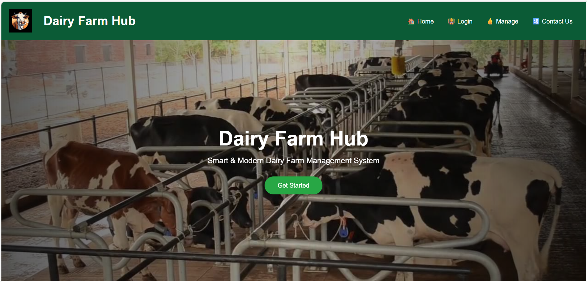

# 🐄 Dairy Farm Hub

A full-stack web application to efficiently manage dairy farm operations, including farmer/vendor data, transactions, and backend services.

---

## 📌 Project Overview

Dairy Farm Hub is designed to simplify dairy farm management by providing a structured system for handling records, operations, and data storage using a backend server and database.

---

## 🚀 Features

* 🔹 Manage farmers and vendors
* 🔹 Perform CRUD operations (Create, Read, Update, Delete)
* 🔹 RESTful API integration
* 🔹 Secure database connection using environment variables
* 🔹 Backend validation and error handling

---

## 🛠️ Tech Stack

* **Backend:** Node.js, Express.js
* **Database:** MySQL
* **Tools:** Git, GitHub, VS Code

---

## 📂 Project Structure

```
dairyfarm/
│── backend/
│   ├── Server.js
│   ├── package.json
│   └── .env (not uploaded)
│
└── README.md
```

---

## ⚙️ Installation & Setup

### 1️⃣ Clone Repository

```
git clone https://github.com/YOUR_USERNAME/dairy-farm-hub.git
```

### 2️⃣ Navigate to Backend

```
cd backend
```

### 3️⃣ Install Dependencies

```
npm install
```

### 4️⃣ Create `.env` File

Inside backend folder:

```
DB_HOST=127.0.0.1
DB_USER=root
DB_PASSWORD=your_password
DB_NAME=dairyfarm_db
```

### 5️⃣ Run Server

```
node Server.js
```

---

## 🔐 Environment Variables

Sensitive data like database credentials are stored securely using `.env` file and are not uploaded to GitHub.

---

## 📡 API Example

### Health Check

```
GET /health
```

Response:

```
{
  "ok": true,
  "msg": "Backend working ✅"
}
```

---

## 📸 Screenshots


## 👩‍💻 Author

**Your Name**
Jyoti yadav 

## ⭐ Acknowledgment

This project was built as a learning step toward full-stack development and backend engineering.
